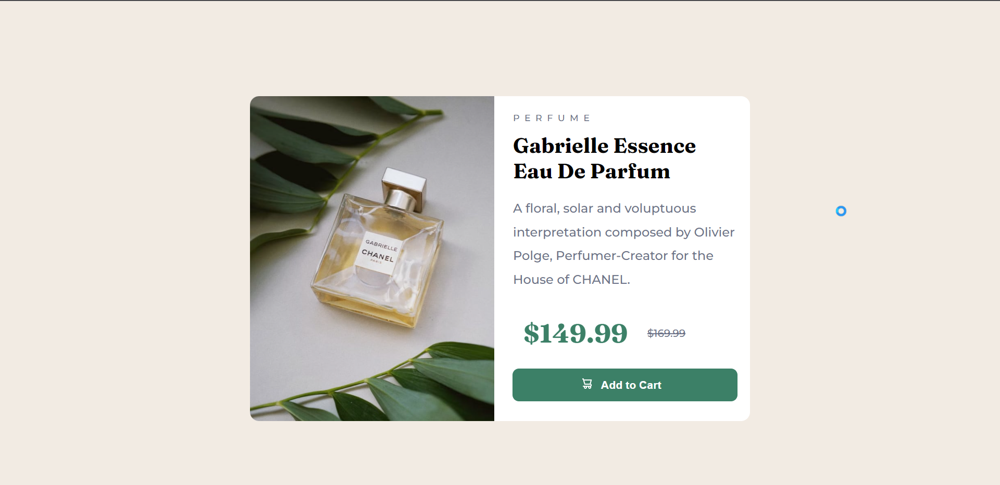

This is a solution to the [Product preview card component challenge on Frontend Mentor](https://www.frontendmentor.io/challenges/product-preview-card-component-GO7UmttRfa). Frontend Mentor challenges help you improve your coding skills by building realistic projects. 

## Table of contents

- [Overview](#overview)
  - [The challenge](#the-challenge)
  - [Screenshot](#screenshot)
  - [Links](#links)
- [My process](#my-process)
  - [Built with](#built-with)
  - [What I learned](#what-i-learned)
  - [Continued development](#continued-development)

## Overview

### The challenge

Users should be able to:

- View the optimal layout depending on their device's screen size
- See hover and focus states for interactive elements

### Compatibility

### Links

- Live Site URL: [Add live site URL here](https://derrick-ndemo.github.io/Bruuh.github.io/)

## My process

### Built with

- Semantic HTML5 markup
- CSS custom properties
- Flexbox
- CSS Grid
- Mobile-first workflow

### Continued development

Future plans include adding:
- Box shadow
- making the buttons interactive
- etc.

## Author

- Website - [Bruuuuh](https://derrick-ndemo.github.io/Bruuh.github.io/)
- Frontend Mentor - [@Bluesanta5](https://www.frontendmentor.io/profile/Bluesanta5)
- Twitter - [@santagotthejuic](https://www.twitter.com/santagotthejuic)
